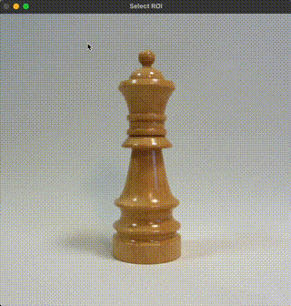

# digitalizing-real-life-objects
Virtual Humans Project


## Installation Guide

## Usage Guide

### Background Removal Guide
`remove_background.py` is a script that uses Meta's Segment Anything Model (SAM2) to segment objects from images.
It supports both single-image and multi-image inputs, offering interactive options for precise segmentation.
The output is saved as RGBA images, where the background is transparent.

#### Usage
```
usage: remove_background.py [-h] [--checkpoint CHECKPOINT]
                            [--model-type MODEL_TYPE] --input INPUT
                            --output OUTPUT [--device {cpu,cuda,auto}]
                            [--no-interaction]
```

**Required Arguments:**

- ```input```: Path to an image or directory containing images.
- ```output```: Directory where segmented RGBA outputs will be saved.

**Optional Arguments:**

- ```checkpoint```: Path to a SAM checkpoint file. If not provided, the default model will be used or downloaded.
- ```model-type```: Specify the SAM model type (vit_h, vit_l, or vit_b). Default is vit_h.
- ```device```: Specify computation device (cpu, cuda, or auto). Default is auto.
- ```no-interaction```: Perform segmentation without user interaction. Suitable for simple, non-specific segmentations.

#### Example Commands

**Single Image Segmentation with Interaction**
```
python utils/remove_background.py --input path/to/image.jpg --output path/to/output
```

**Batch Segmentation without Interaction**
```
python utils/remove_background.py --input path/to/images/ --output path/to/output --no-interaction
```

**Custom Checkpoint and GPU Usage**
```
python utils/remove_background.py --checkpoint path/to/sam_checkpoint.pth --input path/to/image.jpg --output path/to/output --device cuda
```

#### Workflow

1. Interactive Mode:
    - Select a bounding box for the object using an OpenCV window.
    - Optionally, refine the segmentation by selecting points within the bounding box.
    - Choose from multiple candidate masks if generated.
2. Non-Interactive Mode:
    - Attempts to segment the entire image automatically (usually fails).
3. Output:
    - Each segmented image is saved in RGBA format, where the background is transparent.


**Here is a video that shows the workflow:**

